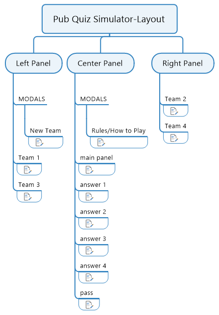

# Pub Quiz Simulator
Looking at the various options for a P1 game, I saw that the majority of them are variations on a theme of a basic design pattern: "Start a timer, show the user some stuff, get some input from the user, process that input, eventually coming to a final result".
This is a perfectly good design pattern, but I wanted to go beyond it.  
My initial thought (below)

### Welcome to the *Bar at the End of Time*, where it is always **NOW**, we **NEVER** close, and Pub Quiz is just about to start!
Was neat, but was single player per session with a leaderboard.
Where we are at in the course, a persistence mechanism (which would rely on an API in the middle or a direct connection to a data source of some kind) is a bit beyond the scope.
It occurred to me, though, that the real of fun of pub quiz is competition, silly team names, and maybe a little trash talk...

[PLAY](https://iamniama.github.io/PubQuizSimulator/)

## The Concept
* 10 2 minute rounds of multiple choice (4 choices) trivia *This was intolerably long for demo purposes, so I shortened it to 15 seconds, though the round value is still customizable*
    * questions selected from a pool of *20-25* to enhance replay value
    * at the ~~1 minute mark~~ **50% timer elapsed**, one wrong choice is replaced with a witty remark, and the point value of the question is reduced
    * at the ~~30 second~~ **75% timer elapsed** mark, another wrong choice is replaced with a witty remark, and the point value goes down again
    * A wrong answer or no answer results in a loss of points
        * Not answering costs more points than being wrong
        * Team may PASS before the 1 minute mark to skip the question without losing points

* A player provides a team name and ~~selects a logo from a curated list~~ *I took the logo out due to time constraints* . Player's team information (name ~~and icon selection~~) ~~will~~ is persisted in a cookie *(5-10 icons, most likely)*

* The game selects three opponents for the player:
    * One *standard* opponent, who will make a random guess at a random point in the round
    * One *weak* opponent who *should always* lose
    * One *Hero* opponent, who will have one or more advantages, such as multiple guesses and a higher likelihood of anwering earlier in the round.

* Each team is presented with a series of **ten** *(customizable in the code)* questions, one at a time.
  * There is ~~no~~ a break between questions ~~, unlike in the real world.  This is the *Bar at the End of Time*, where it is **Always NOW**~~ Neat idea, but made the game hard to follow.  Now there is a button for that...

* At the end of every round, score is updated
  * ~~A special flair will be given to the team in the lead~~ This also was cut for time constraints, and because I cut icons and flair out
  * Some teams will make "comments" at the end or beginning of a round

* At the end of the ~~10th round~~ game, we announce a winner.
    * Computer teams that win will also have a comment of some kind

**NOTE: team names were adjusted because I was usually making them late at night **
* The Teams
    * Standard Teams
        * Algorithm Section
        * Jawascript
        * Oracles of Delphi
        * BASIC Bishes
    * Weak Teams
        * Drunky Brewster: (never answers, will make random comments)
        * PASSive Aggression: (always passes in the first 10 seconds, no comments)
        * The Metal Dudes: (always pick B)
    * Hero Teams
        * Real Housewives of Stepford:  (answers after ~30 seconds, gets 2 chances to get it right, will trash talk Karen style)
        * The Odds: (answers at a random point in the round, 3 chances to get it right, makes super-random remarks)
        * PEP-8 Squad: (answers after ~60 seconds, 3 chances to get it right, makes positive, and well formatted, comments)
        * Buzzer Beaters: (guaranteed to get the right answer, at the very end of the round when the question is worth the least)

## Flow/User Stories
1. Page loads
2. If new player (based on cookie check), we show a modal to define a team (enter name and select logo)
   1. User chooses team stuff
   2. new Team modal goes away
3. After registration, or if existing team, show button to start game *after the instructions modal is closed...*
   1. button goes away while game is in progress
   2. App selects 1 standard opponent, 1 weak opponent, and 1 Hero opponent
4. Game is a series of 10 timed rounds
5. At the beginning of each round, start a ~~2minute~~ timer
6. Display the question text, four possible answers, and the pass button
7. Pass button allows team to skip without losing points for no/wrong answer
8. At 50% time elapsed, ~~hide pass button~~, *due to shorter rounds, the pass button stays for the whole round for the moment*
   1. and swap one answer for the alternate value 
   2. and lower the question's point value
9. At 75% time elapsed, swap another answer for the alternate value
    1. and lower the question's point value
10. When Team answers or time elapses, capture the score for that question
    1. and reset the timer
    2. and repeat from 5 above, effectively
11. After 10 rounds, tally the total score
    1. update the Team scores
    2. ~~update the flair for the top team~~
    3. reset the main panel (questions/answers) and buttons
12. Game should end if window loses focus (no cheating!) *another time issue, though with the shorter round times, its kinda moot*

## Wireframe/Page Layout

>   The general approach is a 3 column layout below an image-based header.

>   To limit the number of special fonts, some text displays, like the heaeder, will be images instead of text.

>   The side columns will show team information such as name/logo/current score
>   The central panel will have the buttons for starting the game, advancing to the next round, and will show the text of questions above 4 possible answers and a pass button

Pub Quiz Simulator-Layout

1.  Left Panel

    1.  MODALS

        1.  New Team

            Enter name, select image, goes away after cookie is set

    2.  Team 1

        Team panels will show team name at top with a possible flair in the
        upper right corner if team is winning. Team icon/logo displayed in the
        bottom.

        If a team makes a comment/trash-talk, their team panel will be overlaid
        with the remark until the start of the next round.

    3.  Team 3

        Team panels will show team name at top with a possible flair in the
        upper right corner if team is winning. Team icon/logo displayed in the
        bottom.

        If a team makes a comment/trash-talk, their team panel will be overlaid
        with the remark until the start of the next round.

2.  Center Panel

    1.  MODALS

        1.  Rules/How to Play

            description of the rules, and gives some backstory on the Hero teams

    2.  main panel

        Will have the start button when game is not in progress, otherwise
        displays the question for the current round, and possibly a tally of how
        the scores change at the end of each round with a button to start the
        next round

    3.  answer 1

        clickable div with a custom attribute indicating which answer was
        chosen. text may be replaced with a secondary comment if it is ruled out
        as wrong answer at the 1m or 30s mark

    4.  answer 2

        clickable div with a custom attribute indicating which answer was
        chosen. text may be replaced with a secondary comment if it is ruled out
        as wrong answer at the 1m or 30s mark

    5.  answer 3

        clickable div with a custom attribute indicating which answer was
        chosen. text may be replaced with a secondary comment if it is ruled out
        as wrong answer at the 1m or 30s mark

    6.  answer 4

        clickable div with a custom attribute indicating which answer was
        chosen. text may be replaced with a secondary comment if it is ruled out
        as wrong answer at the 1m or 30s mark

    7.  pass

        clickable div that allows a player to surrender without losing points.
        disabled after the im mark in a round

3.  Right Panel

    1.  Team 2

        Team panels will show team name at top with a possible flair in the
        upper right corner if team is winning. Team icon/logo displayed in the
        bottom.

        If a team makes a comment/trash-talk, their team panel will be overlaid
        with the remark until the start of the next round.

    2.  Team 4

        Team panels will show team name at top with a possible flair in the
        upper right corner if team is winning. Team icon/logo displayed in the
        bottom.

        If a team makes a comment/trash-talk, their team panel will be overlaid
        with the remark until the start of the next round.
